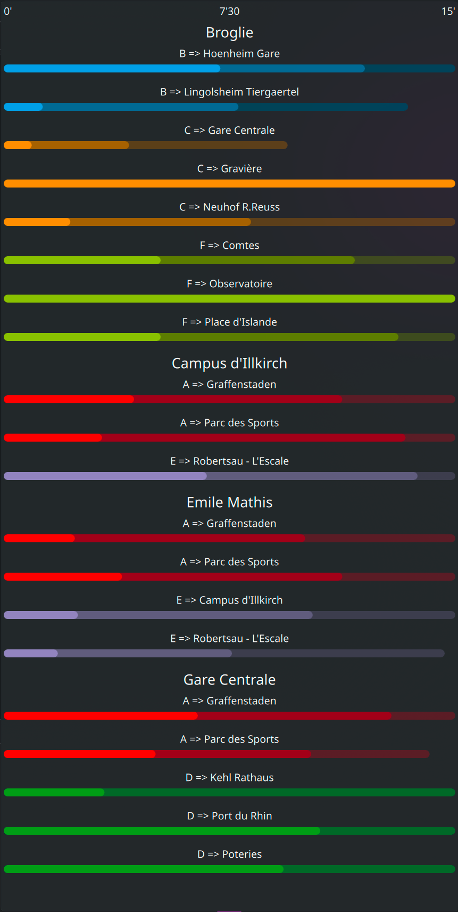

# CTS Timetable widget



## How to install

```bash
git clone https://github.com/nothixy/cts-timetable-plasmoid
cd cts-timetable-plasmoid/package
plasmapkg2 -i .
```

Then log out and log back in, you should now be able to add the widget.

## Configuration

This widget needs an API key from CTS, you can request one at https://www.cts-strasbourg.eu/fr/portail-open-data/

Once you have your API key, just paste in the "Token" field of the configuration module

You can then monitor stops by their IDs. To list all available stops, run
```bash
# Replace MY_TOKEN with your API key
curl -u "<MY_TOKEN>:" https://api.cts-strasbourg.eu/v1/siri/2.0/stoppoints-discovery
```
You will see that there are multiple stops with the same name, there is one per transport type - direction pair.
